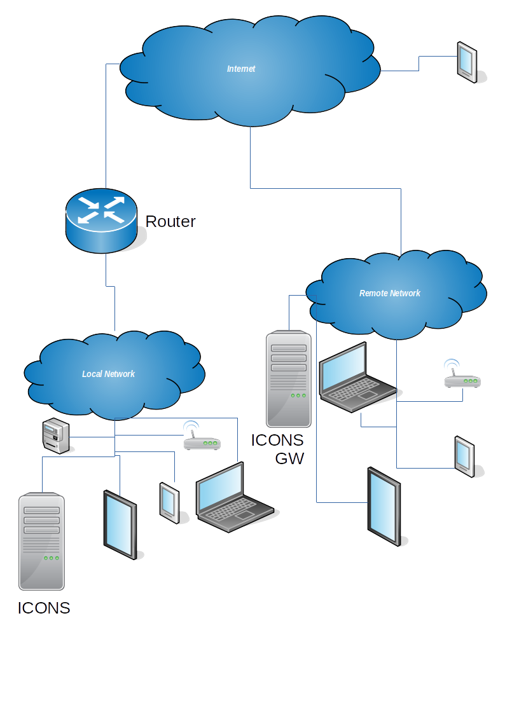

# yView
yView is a framework that allows any device which offers a service over a TCP socket to be connected to a private network using only an ssh server connected to the Internet. yView can be used for accessing devices from small IoT devices all the way up to large servers.

The diagram below shows how the various parts of the yView system connect together.

## Architecture
The architecture is based around the Internet Connection Server (ICONS). This is virtualised as a docker container and has a single ssh port exposed to the Internet.
SSH connections to the ICONS can be made from devices (small embedded devices all the way up to large servers) that offer services to the network (E.G http, ssh, etc).
Connections to the ICONS can also be made from GUI applications running on Linux, Windows, MAC or Android platforms. From these GUI applications device services can be accessed (E.G start a web browser to to connect to a HTTP service).

## System Components

### ICONS
The ICONS (Internet Connection Server) is a docker container that exposes a single ssh port to the outside world. This container runs

- An MQTT server which brokers all messages that pass between devices which offer a service and applications that allow connections to these services. A factor in choosing an MQTT server was that it allows easy migration to cloud computing frameworks (AWS etc) if required in future.
- An MQTT RPC server. This allows remote procedure calls (RPC) to be made from the ICONS gateway component (ICONS GW) as detailed below.
- A standard Linux ssh server.

One advantage in using a docker container to perform this function is that it effectively sandboxes the part of the system exposed to the Internet. The only persistent data in this docker container is the ssh authorised_keys file.

The above diagram shows 'Local' and 'Remote' networks. However many more remote networks can be connected to a single ICONS. See [icons/](icons/) for more information.

### ICONS GW
The ICONS gateway program typically runs on the same machine that the ICONS docker image is running. However it may run on any machine in the same subnetwork as the ICONS. At least one instance of the ICONS gateway should be running in each network. It is the responsibility of the ICONS GW to discover devices (small embedded devices all the way up to large servers) on the local IP sub network and forward the responses to the ICONS. The ICONS GW also has the responsibility of managing connections between the devices that it discovers. See [icons_gw/](icons_gw/) for more information.

### EMBEDDED DEVICES
Embedded devices can be developed to connect to the yView network. A template embedded device application is available [here](embedded_devices/mgos/).

The following embedded devices have been developed for connection to the yView network.

* [YSG](embedded_devices/ysg/)
* [YSmartMeter](https://projects.pausten.me.uk/ysmartmeter.html)
* [YSW8](https://projects.pausten.me.uk/ysw8.html)
* [YSW3](https://projects.pausten.me.uk/WySW3.html)

### YVIEW GUI
Two yView applications are currently available.

- A Java application that will run on Linux, Windows and Apple MAC computers. Currently installers only exist for Linux computers. See [gui/java](gui/java) for more information on this application.

- An Android application. See [gui/android](gui/android) for more information on this application.

### ydev
This is a small python program that runs on any device (small embedded devices all the way up to large servers) that sits on an IP subnetwork that can hear discovery messages from an ICONS GW instance. See [ydev/](ydev/) for more information.

Some devices do not have sufficient processing power to run Python and therefore the ydev program cannot be used. Example code is provided to allow such devices to become part of the yView network. See [embedded_devices/mgos/](embedded_devices/mgos/) for more information.

## System Operation
This section gives an overview of how the system architecture operates under normal circumstances.

An instance of the Icons docker image must be running as all system communication passes through this.

When an ICONS GW is started it builds an ssh connection to the ICONS. If the ICONS does not have a copy of the ssh public key (local to the ICONS GW) then the user is prompted to login to the ICONS server (over ssh) and the public ssh key is copied to the ICONS. Once the public ssh key is copied the ICONS GW will automatically login to the ICONS. Once ssh connection to the ICONS is built the ICONS GW builds another connection through the ssh connection (tunnelled) to the MQTT server running inside the ICONS.

The ICONS gateway then sends out broadcast messages (UDP) on it's local sub network in order to discover devices that are offering services to the yView network. These messages are referred to as 'are you there' (AYT) messages. As each response (JSON) is received the ICONS GW builds reverse ssh tunnels to the ICONS. These ssh tunnels are used later when a GUI client wishes to connect to the device. The responses are also forwarded to the ICONS over the ssh tunnel built previously to the ICONS MQTT server.

The GUI application (Java or Android) starts by building an ssh connection to the ICONS. Immediately after this  another connection is built through this ssh connection (tunnelled) to the MQTT server running inside the ICONS for use below. The GUI application then subscribes to an MQTT topic and starts receiving messages from connected devices that responded to any AYT message (from an ICONS GW) in the yView network. These response messages detail a location and type of service along with other information about the device.

The GUI then displays the location as a tab containing a table. Each table row equates to a single remote device. If the user double clicks a table row they are presented with options to connect to that device. These options typically involve starting an external program to connect to the service selected (E.G web browser for http services, ssh client for an ssh service or a vnc client for a VNC service).

When the user attempts to connect to a remote device another tunnelled ssh connection is built to the ICONS and connected to the previously connected reverse ssh tunnel. This enables a direct connection from the GUI application to the remote device through the ICONS. E.G a web browser can communicate directly with the remote device.

## Networking considerations

Your router must be configured to forward a single TCP/IP port from it's Internet interface to the ICONS ssh port.

Another consideration is that your routers IP address may not be static as it is probably served from your ISP's DHCP server. Therefore it maybe necessary to use a dynamic DNS provider (E.G [Free DDNS](https://freedns.afraid.org/)) in order that you can connect to a domain name that is constantly updated with your routers IP address on the Internet. See [Dynamic DNS](https://en.wikipedia.org/wiki/Dynamic_DNS) for more details.
