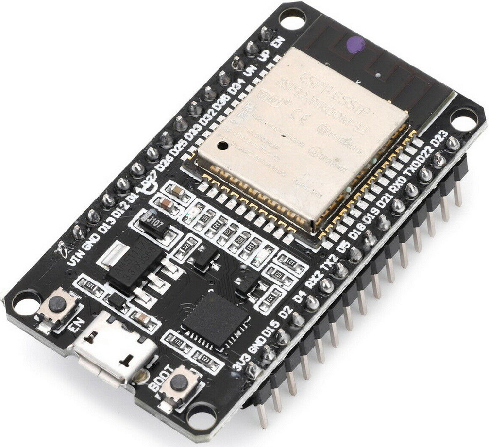

# Template ydev app

## Overview
This is an empty ydev program for ESP8266 and ESP32 devices. This allows a starting point for building software for devices to connect to the yView network. The functionality includes the following.

 * Ability to setup the WiFi using a mobile or tablet using a single button connected to GPIO0 and an LED connected to GPIO2 pins on an ESP8266 or ESP32 device.
 * Once the WiFi is configured a web interface is presented that allows the user to
   * A reset to factory defaults.
   * Reboot the device.
   * Save configuration persistently on the the device.
   * Execute code on the device (via RPC calls over Ajax) via an http server on the device.1

## GUI examples
The following image shows the WiFi setup interface.


Once connected to the Wifi GPIO2 will go high and an LED on this pin turn on to indicate the device is connected to the WiFi network. Once on the WiFi network it will hear are you there messages from the ICONS GW and this will cause the device to appear in the yView GUI (See [../../gui/java](../../gui/java) or [../../gui/android](../../gui/android) for more information on these). From here you can connect to the device via a web browser. When connected the following should be seen.


These pages are the defaults for the example application and as such would need to be changed when developing a project. This would involve changes to the fs/product.html, fs/product.js and the C code in the src folder. The example shows how to save configuration parameters persistently on the device (via the flash filing system) and also how to invoke remote procedure calls (RPC's) from the web interface to the device.

## Building
Run the following command to build the code initially

```./build.py --target esp8266 --clean```

or

```./build.py --target esp32 --clean```

Depending upon the target device. Other devices supported by Mongoose OS ([https://mongoose-os.com/](https://mongoose-os.com/)) have not been tested with the yView framework.

## Loading
The sload.sh and wload.sh script files can be used to load code onto the target device.

### sload.sh
This script loads the device over the serial port. Before loading the following requirements must be met.

 *  The TXD, RXD and GND lines of the ESP32 or ESP8266 device must be connected to a serial port on the PC.
 * GPIO0 (same for ESP32 and ESP8266 devices) is held low when the devices is released from reset/powered up.

Run the following command to load the code to the device over the serial port.

 ```./sload.sh```

### wload.sh
The wload.sh script can be used to load code to a device over a WiFi connection. Ensure the device is pingable before attempting to load code over a WiFi connection. The following command can be used to load code over the WiFi (Change the IP address for your devices IP address).

```./wload.sh 192.168.1.1```

## Hardware
Node MCU devices such as this detailed below may be purchased cheaply on Ebay (search for 'nodeMcu esp8266' or 'nodeMcu esp32') and the software here maybe loaded onto these in order to get up and running quickly with minimal cost. These modules have the LED and switch required to enable WiFi to be setup as detailed above.



