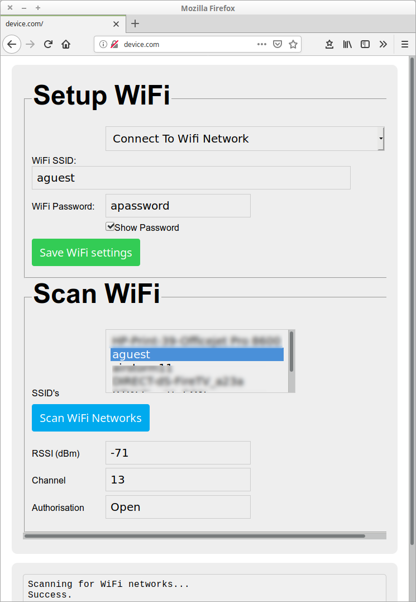
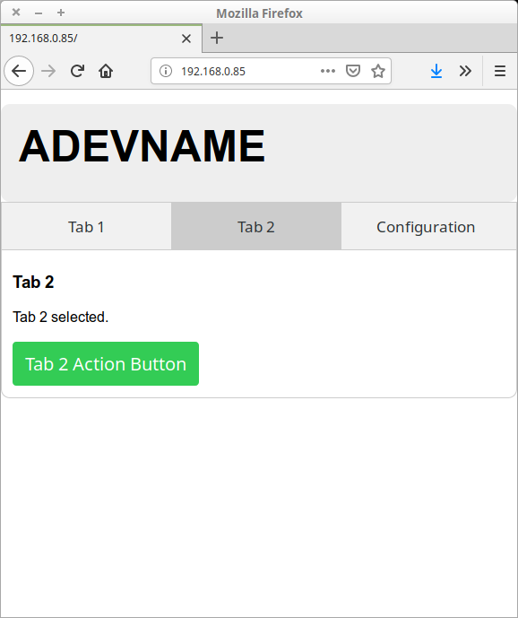

# Template ydev app

## Overview
This is an empty YDev program for ESP8266 and ESP32 devices. This allows a starting point for building software for devices to connect to the yView network. The functionality includes the following.

 * Ability to setup the WiFi using a mobile or tablet using a single button connected to GPIO0 and an LED connected to GPIO2 pins on an ESP8266 or ESP32 device.
 * Once the WiFi is configured a web interface is presented that allows the user to
   * A reset to factory defaults.
   * Reboot the device.
   * Save configuration persistently on the the device.
   * Execute code on the device (via RPC calls over Ajax) from the devices web interface, passing parameters to this code from the web interface.

## GUI examples
The following image shows the WiFi setup interface.



Once connected to the Wifi the device will appear in the yView GUI (See [../../gui/java](../../gui/java) or [../../gui/android](../../gui/android) for more information on these). From here you can connect to the device via a web browser. When connected the following should be seen.





These pages are the defaults for the example application and as such would need to be changed when developing a project. This would involve changes to the fs/product.html, fs/product.js and the C code in the src folder.

## Building
Run the following command to build the code initially

```./build.py --target esp8266 --clean```

or

```./build.py --target esp32 --clean```

Depending upon the target device. Other devices supported by Mongoose OS ([https://mongoose-os.com/](https://mongoose-os.com/)) have not been tested with the yView framework.

## Loading
The sload.sh and wload.sh script files can be used to load code onto the target device.

### sload.sh
This script loads the device over the serial port. Before loading the following requirements must be met.

 *  The TXD, RXD and GND lines of the ESP32 or ESP8266 device must be connected to a serial port on the PC.
 * GPIO0 (same for ESP32 and ESP8266 devices) is held low when the devices is released from reset/powered up.

Run the following command to load the code to the device over the serial port.

 ```./sload.sh```

### wload.sh
The wload.sh script can be used to load code to a device over a WiFi connection. Ensure the device is pingable before attempting to load code over a WiFi connection. The following command can be used to load code over the WiFi (Change the IP address for your devices IP address).

```./wload.sh 192.168.1.1```
