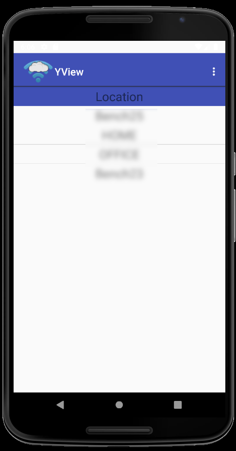
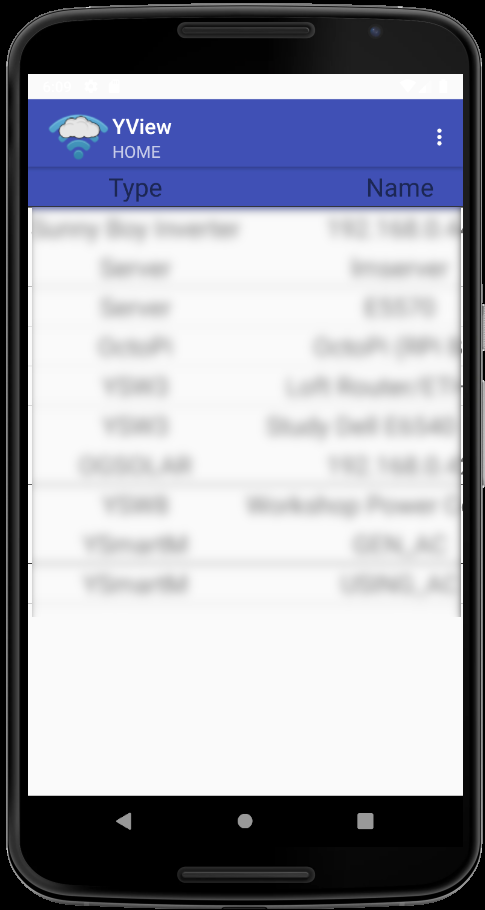
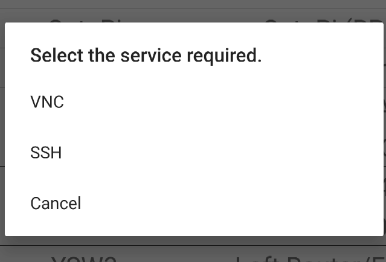
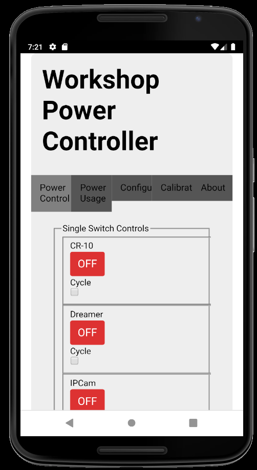

# yView GUI
This application runs on an Android phone or tablet and provides access to a 
yView network.

# Android Studio project
This folder contains an AndroidStudio project ([https://developer.android.com/studio/](https://developer.android.com/studio/)). The project maybe loaded into AndroidStudio v3.5 or later. Android Studio will allow you to load the yView app onto your phone/tablet.

# Screen Shots
The main screen shows a list. Each row in the list is the name of a different location. 

Select a location by touching the row and a list of all the devices detected at that location is displayed.

If a row is selected then a popup is displayed if more than one service is offered by the device. An example of this is shown below.

Users can select the option they wish. An app must be installed to connect to the service. In the example shown [JuiceSSH](https://juicessh.com/) will provide connection to the ssh host although other ssh apps are available.  In the example shown [RealVNC](https://www.realvnc.com/en/connect/download/viewer/android/) will connect to a VNC server. These apps are available on google play.

The example below shows a ([YSW8](https://projects.pausten.me.uk/ysw8.html)) device connected via a web browser service. In this case the yView app launches the default web browser to connect to the device.

