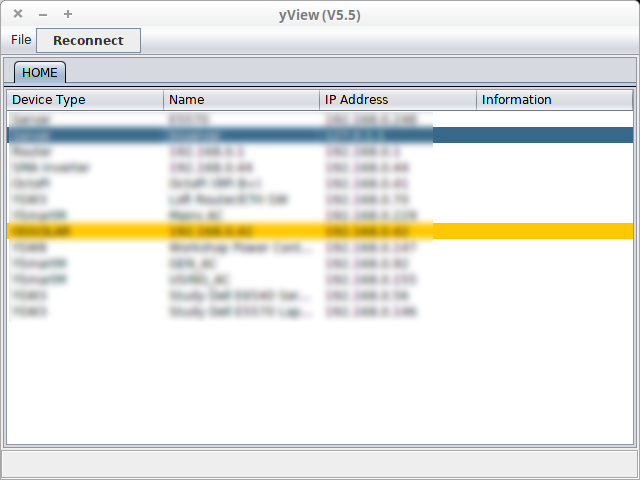
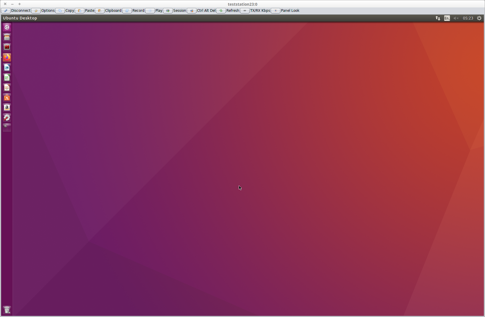
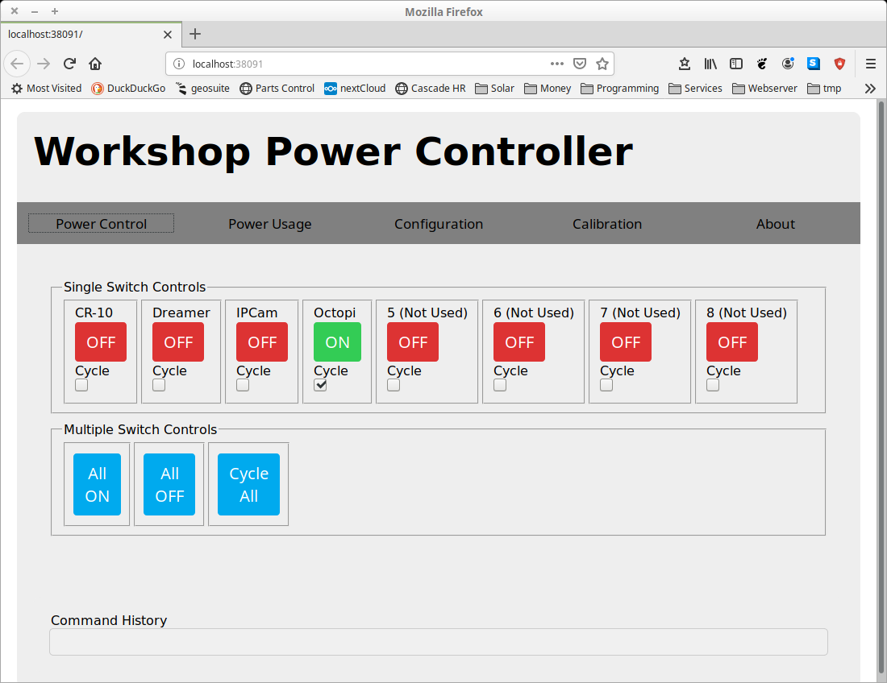
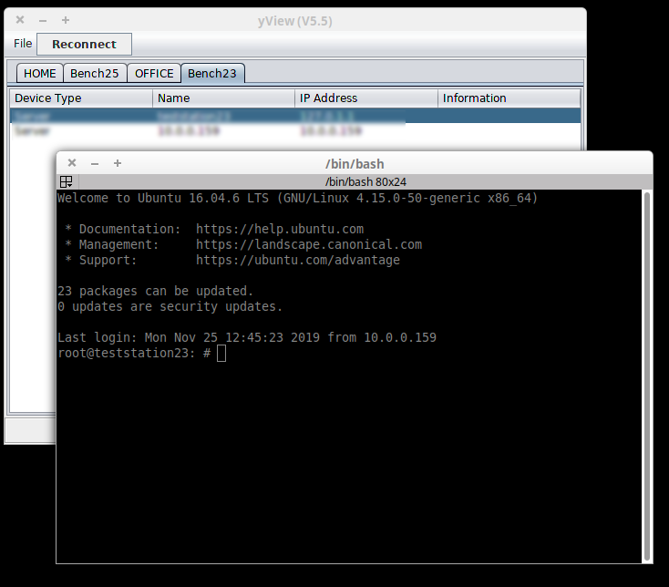

# yView GUI
This application runs on a Java JVM and provides access to a yView
network.

Currently a debian installer exists for Linux platforms. For non
Linux platforms the yview.jar file maybe used using the java 
command line below.

 `java -jar jview.jar'
 
 On Windows platforms it should be possible to double click 
 on the yview.jar file assuming that Java is installed.
 
## yView Main Window
 

 Each tab shows the detected devices at a location. Each row in the 
 table is a separate device. If the user double clicks on a device a popup menu appears that lists the options available to connect to the device (E.G web browser, ssh, vnc etc...). 
 
 The options presented can be configured to connect using internal (to yView, E.G VNC) or external applications. 
 
 ## File Menu
 The File Menu contains the following options
 
 - Group Name
 yView devices maybe segregated into groups. This options allows you to change which group you are currently a member of. Only yView devices with the same group name are visible. By default no groups are defined and so all devices are visible.
 
 - Warning device timeout
 This options allows you to set the warning timeout period in seconds. If no update is received for this time period then the device row will turn orange.
 
  - Lost device timeout
 This options allows you to set the lost device timeout period in seconds. If no update is received for this time period then the device row is removed.
 
 - Icon Server Configuration
 This option presents a dialog where the list of ICON servers is managed. For each ICON server a username, server address and server port maybe set. It is also possible to enable and disable each server.
 
 - Device Message Viewer
 This option allows you to view the JSON messages that flow through the yView network.
 
 - Look And Feel
 Allow the GUI look and feel to be configured.
 
 - Exit
 Exit the application.
 
The Reconnect button forces a reconnect to the ICONS.
 
 ## Connection Examples

### yView VNC
The following screen shows a connection through yView to a VNC server running on an Ubuntu Linux machine using the internal VNC application.
  
 
### yView Web Browser
The following screen shows a connection through yView to a YSW8 device ([YSW8 details](https://projects.pausten.me.uk/ysw8.html)) device via an external web browser application.

 

 ### yView ssh
 The following screen shows a connection through yView to an ssh server on a Linux server via an external application.

  